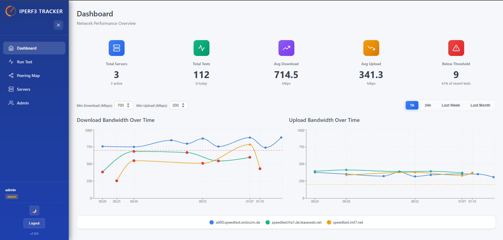

# iperf3 Tracker

A self-hosted application to monitor and track network performance using iperf3 tests. Similar to Speedtest-Tracker but for iperf3.

> ⚠️ **Early Development Stage**  
> This project is in early development. Expect bugs, missing features, and breaking changes. Extensive testing and bug fixing is still required. Use in production environments at your own risk.

## Features

- **Automated Testing**: Schedule periodic iperf3 tests against multiple servers
- **Rich Dashboards**: Visualize bandwidth over time with interactive charts
- **Parallel Transfers**: Configure number of parallel streams (-P flag)
- **Multiple Server Profiles**: Test against different servers (LAN, WAN, remote locations)
- **Historical Data**: Track performance trends and analyze patterns (bandwidth, jitter, packet loss)
- **Docker Ready**: Easy deployment with Docker and Docker Compose
- **Web Interface**: Modern, responsive React-based UI
- **REST API**: Full API access for automation and integration

## Screenshots


*Main Dashboard - Real-time network performance monitoring*

## Architecture

- **Backend**: Python FastAPI with SQLAlchemy ORM
- **Frontend**: React with TypeScript and Recharts
- **Database**: SQLite (upgradeable to PostgreSQL)
- **Scheduler**: APScheduler for automated tests
- **Containerization**: Docker & Docker Compose

## Quick Start

### Prerequisites

- Docker and Docker Compose installed
- OR: Python 3.11+, Node.js 18+, and iperf3 installed on your system
- At least one iperf3 server to test against

### Using Docker (Recommended)

```bash
# Clone the repository
git clone <repository-url>
cd iperf-Tracker

# Start the application
docker-compose up -d

# Access the web interface
# Frontend: http://localhost:3000
# API: http://localhost:8000
# API Docs: http://localhost:8000/docs
```

### Manual Setup

#### Backend

```bash
cd backend

# Create virtual environment
python -m venv venv
.\venv\Scripts\Activate.ps1  # Windows PowerShell

# Install dependencies
pip install -r requirements.txt

# Run migrations
alembic upgrade head

# Start the server
uvicorn app.main:app --reload --host 0.0.0.0 --port 8000
```

#### Frontend

```bash
cd frontend

# Install dependencies
npm install

# Start development server
npm start
```

## Configuration

### Server Profiles

Add iperf3 servers through the web interface or API:

```json
{
  "name": "Local LAN Server",
  "host": "192.168.1.100",
  "port": 5201,
  "enabled": true
}
```

### Test Configuration

Configure test parameters:
- **Interval**: How often to run tests (e.g., every 30 minutes)
- **Duration**: Test duration in seconds (default: 10)
- **Parallel Streams**: Number of parallel connections (1-128)
- **Protocol**: TCP or UDP
- **Direction**: Download, Upload, or Bidirectional

## API Documentation

Full API documentation is available at `http://localhost:8000/docs` when running.

### Key Endpoints

- `GET /api/servers` - List all server profiles
- `POST /api/servers` - Create new server profile
- `GET /api/tests` - List test results with filters
- `POST /api/tests/run` - Run immediate test
- `GET /api/stats` - Get statistics and aggregations

## Development

### Project Structure

```
iperf-Tracker/
├── backend/
│   ├── app/
│   │   ├── api/
│   │   │   ├── routes/       # API route handlers
│   │   │   │   ├── auth.py
│   │   │   │   ├── servers.py
│   │   │   │   ├── tests.py
│   │   │   │   └── users.py
│   │   │   └── deps.py       # Dependencies
│   │   ├── core/
│   │   │   ├── config.py     # Configuration
│   │   │   └── security.py   # Auth & JWT
│   │   ├── models/
│   │   │   └── models.py     # SQLAlchemy models
│   │   ├── schemas/
│   │   │   └── schemas.py    # Pydantic schemas
│   │   ├── services/
│   │   │   ├── iperf_service.py  # iperf3 execution
│   │   │   └── scheduler.py      # Test scheduling
│   │   ├── database.py       # Database setup
│   │   └── main.py           # FastAPI app
│   ├── alembic/              # Database migrations
│   │   ├── versions/
│   │   └── env.py
│   ├── requirements.txt
│   ├── alembic.ini
│   └── Dockerfile
├── frontend/
│   ├── public/
│   ├── src/
│   │   ├── components/
│   │   │   ├── AdminPanel.tsx
│   │   │   ├── Dashboard.tsx
│   │   │   ├── Login.tsx
│   │   │   ├── ServerManager.tsx
│   │   │   ├── TestRunner.tsx
│   │   │   ├── AdminPanel.css
│   │   │   ├── Dashboard.css
│   │   │   ├── Login.css
│   │   │   └── ...
│   │   ├── services/
│   │   │   └── api.ts        # API client
│   │   ├── index.tsx         # App entry point
│   │   └── index.css         # Global styles
│   ├── package.json
│   ├── tsconfig.json
│   └── Dockerfile
├── docker-compose.yml
└── README.md
```

### Running Tests

```bash
# Backend tests
cd backend
pytest

# Frontend tests
cd frontend
npm test
```

## License

MIT License

## Contributing

Contributions are welcome! Please feel free to submit a Pull Request.
