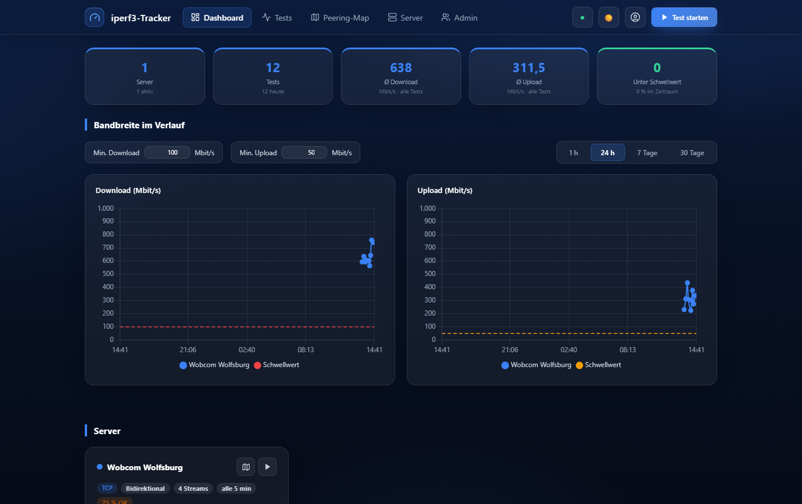
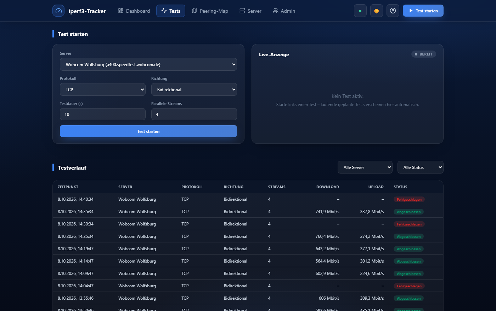
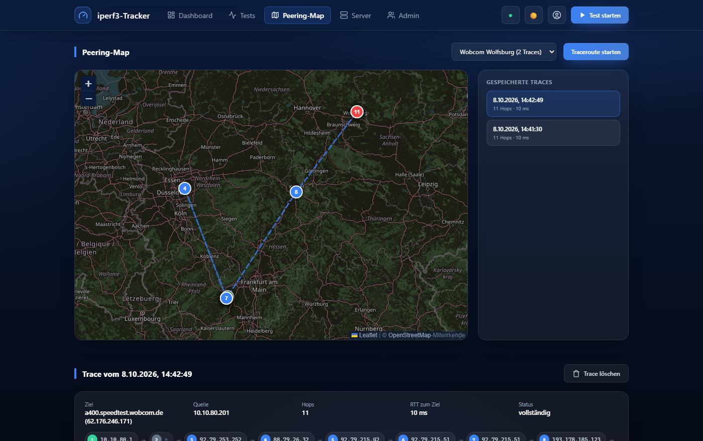
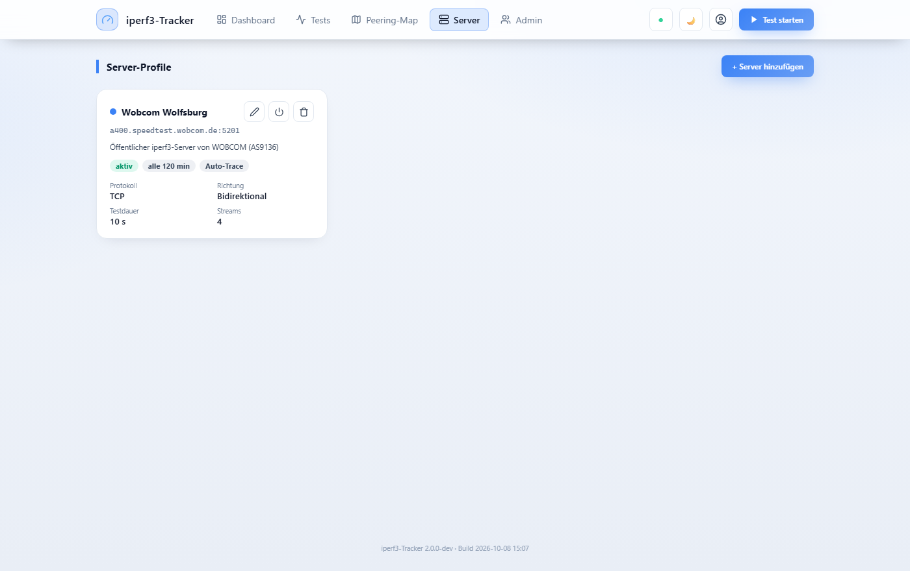

# iperf3-Tracker

Measures bandwidth to iperf3 servers on a schedule, keeps the results as
history and shows the network path on a map. A single Go binary serves both
the API and the web interface – no additional runtime or web server needed.



## Features

- **Dashboard** – key figures, download/upload history per server with
  thresholds, live progress of running tests
- **Tests** – run tests with any parameters (TCP/UDP, download, upload,
  bidirectional, parallel streams, UDP target bandwidth), live view, test
  history with details and raw iperf3 output
- **Scheduling** – tests per server at a configurable interval, optionally
  followed by a traceroute (auto-trace)
- **Peering map** – live traceroute on a map with locations from the
  GeoLite2 database (missing locations are estimated from neighbouring hops),
  path and hop table also for private networks
- **Server profiles** – your own or public iperf3 servers (selection list)
- **Administration** – users, cleanup of old data, database statistics
- German and English user interface (language switch with the globe icon in
  the header and on the login page; defaults to the browser language), light/dark
  theme, mobile friendly

| Tests | Peering map | Servers (light theme) |
|---|---|---|
|  |  |  |

## Requirements

- **iperf3 version 3.17 or newer** (for `--json-stream`). If iperf3 is
  missing, the web interface offers administrators to install it after login –
  via winget on Windows, via the available package manager on Linux (apt-get,
  dnf, yum, zypper, apk, pacman; `sudo -n` when not running as root). To
  install without asking on startup, set `iperf.auto_install: true` (e.g. for
  servers where nobody uses the web interface). Manual installation:
  - Windows: `winget install ar51an.iPerf3`
  - Linux: the distribution's `iperf3` package, if it is at least 3.17
    (e.g. Debian 13: `apt install iperf3`)
- **tracert** (Windows, built in) or **traceroute** (Linux)
- To build: **Go 1.24** or newer

## Quick start (Windows)

```cmd
start.cmd
```

Builds `_release\iperf3-tracker.exe` on the first run, starts the service and
opens http://localhost:8000. After code changes, rebuild with `start.cmd neu`
or `build.cmd release`.

First login: **`admin` / `admin123`** – then change the password via the user
menu (person icon at the top right, "Change password").

The binary can also be started directly by double-click. `config.yaml` and
the database (`data\`) are created next to the binary on first start;
`build.cmd` places the GeoIP database in `_release\geoip\`.

## Docker

```bash
docker compose up -d --build
```

One container with iperf3 3.18 and traceroute (Debian trixie); configuration
and database live in the `iperf-data` volume. The interface is available at
`http://<host>:8000`.

> The Docker setup is prepared but not tested yet.

## Configuration

`config.yaml` (see [config.example.yaml](config.example.yaml)); individual
values can be overridden with environment variables:

| Setting | Environment variable | Default |
|---|---|---|
| `web.listen` | `LISTEN_ADDR` | `0.0.0.0:8000` |
| `storage.path` | `DB_PATH` | `data/iperf3-tracker.db` |
| `auth.secret_key` | `SECRET_KEY` | randomly generated on first start |
| `scheduler.enabled` | `SCHEDULER_ENABLED` | `true` |
| `iperf.path` | `IPERF3_PATH` | auto-detected (PATH, winget location) |
| `iperf.auto_install` | `IPERF3_AUTO_INSTALL` | `false` (the web interface asks first) |
| `geoip.path` | `GEOIP_PATH` | `geoip/GeoLite2-City.mmdb` |
| `log.level` | `LOG_LEVEL` | `info` |

Relative paths are resolved against the directory of `config.yaml`.

## Development

```cmd
go test ./...
go run ./cmd/iperf3-tracker
```

| Directory | Contents |
|---|---|
| `cmd/iperf3-tracker` | entry point |
| `internal/web` | HTTP API, live trace (server-sent events), embedded web interface (`static/`) |
| `internal/iperf` | running iperf3, evaluating `--json-stream`, installation |
| `internal/trace` | tracert/traceroute, GeoIP, location interpolation |
| `internal/scheduler` | per-server schedule, auto-trace |
| `internal/store`, `internal/db` | SQLite (pure Go driver, no CGO) |
| `geoip/` | GeoLite2-City database |

The web interface follows the Spherifyer design language and loads Chart.js
and Leaflet from a CDN; the map uses OpenStreetMap tiles.

## GeoIP notice

This product includes GeoLite2 data created by MaxMind, available from
https://www.maxmind.com.
