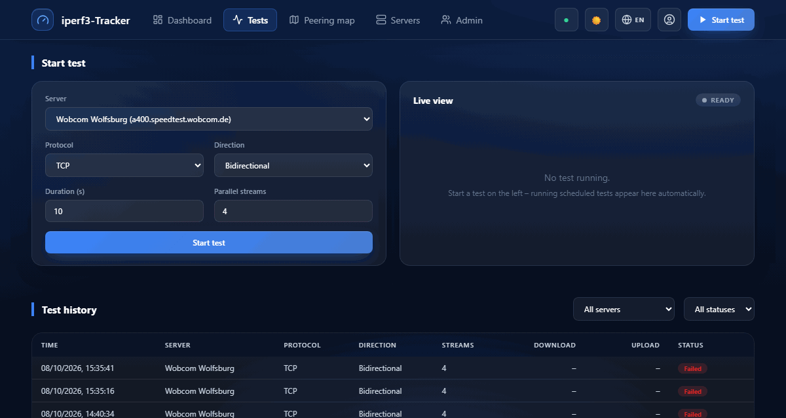
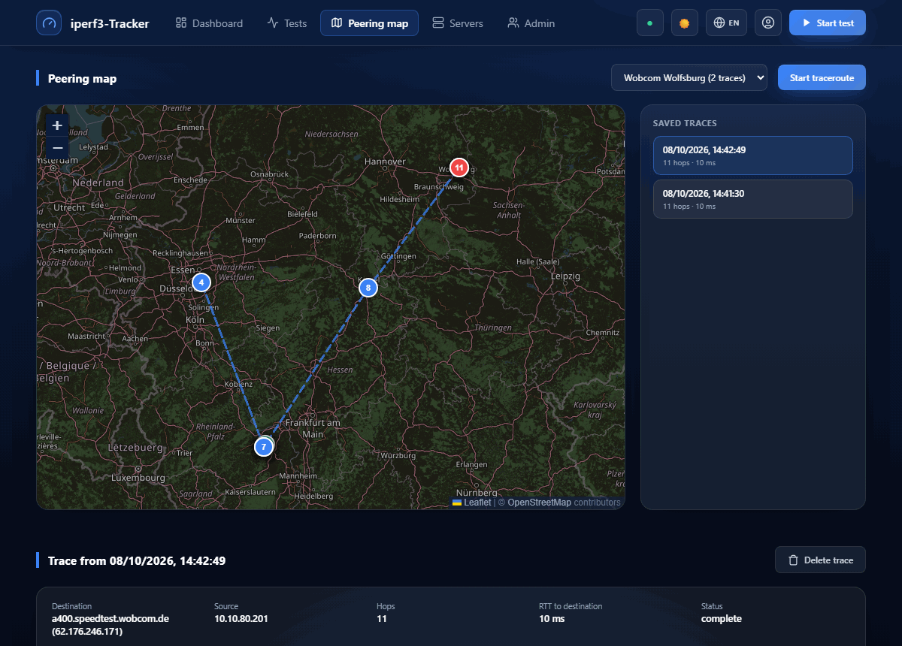

# iperf3-Tracker

Measures bandwidth to iperf3 servers on a schedule, keeps the results as
history and shows the network path on a map. A single Go binary serves both
the API and the web interface – no additional runtime or web server needed.


## Features

- **Dashboard** – key figures, download/upload history per server with
  thresholds, live progress of running tests
- **Tests** – run tests with any parameters (TCP/UDP, download, upload,
  bidirectional, parallel streams, UDP target bandwidth), live view, test
  history with details and raw iperf3 output
- **Scheduling** – tests per server at a configurable interval, optionally
  followed by a traceroute (auto-trace)
- **Peering map** – live traceroute on a map with locations from the
  GeoLite2 database (missing locations are estimated from neighbouring hops),
  path and hop table also for private networks. The world map is embedded
  (Natural Earth, vector) – it works without internet access
- **Server profiles** – your own or public iperf3 servers (selection list)
- **Administration** – users, cleanup of old data, database statistics
- German and English user interface (language switch with the globe icon in
  the header and on the login page; defaults to the browser language, otherwise
  German), light/dark theme following the operating system unless chosen
  explicitly (also on the login page), mobile friendly. API messages follow the
  request's `Accept-Language` header (German without one)
- **No external requests** – Chart.js, Leaflet and the world map are
  embedded in the binary; the page is served with a strict
  Content-Security-Policy (`default-src 'self'`, no inline scripts or styles)


*Running a test – live progress, throughput curve and result*


*Live traceroute on the peering map*


*Server profiles (light theme)*

## Requirements

- **iperf3 version 3.17 or newer** (for `--json-stream`). If iperf3 is
  missing, the web interface offers administrators to install it after login –
  via winget on Windows, via the available package manager on Linux (apt-get,
  dnf, yum, zypper, apk, pacman; `sudo -n` when not running as root). To
  install without asking on startup, set `iperf.auto_install: true` (e.g. for
  servers where nobody uses the web interface). Manual installation:
  - Windows: `winget install ar51an.iPerf3`
  - Linux: the distribution's `iperf3` package, if it is at least 3.17
    (e.g. Debian 13: `apt install iperf3`)
- **tracert** (Windows, built in) or **traceroute** (Linux)
- To build: **Go 1.24** or newer

## Quick start (Windows)

```cmd
start.cmd
```

Builds `_release\iperf3-tracker.exe` on the first run, starts the service and
opens http://localhost:8000. After code changes, rebuild with `start.cmd neu`
or `build.cmd release`.

First login: user **`admin`** with the **random initial password** that is
printed once to the console/log on the very first start (`initial_password=…`).
It must be changed right after signing in. See [Sign-in](#sign-in).

The binary can also be started directly by double-click. `config.yaml` and
the database (`data\`) are created next to the binary on first start;
`build.cmd` places the GeoIP database in `_release\geoip\`.

## Docker

```bash
docker compose up -d --build
```

One container with iperf3 3.18 and traceroute (Debian trixie); configuration
and database live in the `iperf-data` volume. The interface is available at
`http://<host>:8000`; the initial admin password is shown once by
`docker logs iperf3-tracker`.

> The Docker setup is prepared but not tested yet.

## Configuration

`config.yaml` (see [config.example.yaml](config.example.yaml)); every key can
be overridden with an environment variable `IPERF3_<SECTION>_<KEY>`. The
former names without prefix still work but log a deprecation warning.

| Setting | Environment variable | Deprecated alias | Default |
|---|---|---|---|
| `web.listen` | `IPERF3_WEB_LISTEN` | `LISTEN_ADDR` | `127.0.0.1:8000` if unset; the generated `config.yaml` and the Docker image set `0.0.0.0:8000` |
| `storage.path` | `IPERF3_STORAGE_PATH` | `DB_PATH` | `data/iperf3-tracker.db` |
| `auth.secret_key` | `IPERF3_AUTH_SECRET_KEY` | `SECRET_KEY` | randomly generated on first start |
| `auth.session_ttl` | `IPERF3_AUTH_SESSION_TTL` | – | `12h` (session lifetime without activity, sliding; at least `1m`) |
| `scheduler.enabled` | `IPERF3_SCHEDULER_ENABLED` | `SCHEDULER_ENABLED` | `true` |
| `iperf.path` | `IPERF3_IPERF_PATH` | `IPERF3_PATH` | auto-detected (PATH, winget location) |
| `iperf.auto_install` | `IPERF3_IPERF_AUTO_INSTALL` | `IPERF3_AUTO_INSTALL` | `false` (the web interface asks first) |
| `geoip.path` | `IPERF3_GEOIP_PATH` | `GEOIP_PATH` | `geoip/GeoLite2-City.mmdb` |
| `map.tile_url` | `IPERF3_MAP_TILE_URL` | – | empty = embedded offline world map |
| `map.tile_attribution` | `IPERF3_MAP_TILE_ATTRIBUTION` | – | OpenStreetMap notice |
| `log.level` | `IPERF3_LOG_LEVEL` | `LOG_LEVEL` | `info` (`debug`, `info`, `warn`, `error`) |
| `log.format` | `IPERF3_LOG_FORMAT` | – | `text` (`text` or `json`) |

Relative paths are resolved against the directory of `config.yaml`. Log keys
are English (`path`, `error`, …), messages are German.

**Listen address:** without a `web.listen` entry the service only listens on
`127.0.0.1:8000`. The `config.yaml` created on first start and the Docker
setup set `0.0.0.0:8000` explicitly, so existing installations keep being
reachable from the network.

**Map:** by default the peering map draws an embedded world map (Natural Earth
1:110m, public domain) and loads nothing from the internet. If you run your
own tile server, set `map.tile_url` (e.g.
`https://tiles.example.org/{z}/{x}/{y}.png`); its origin is then added to the
Content-Security-Policy (`img-src`).

## Sign-in

- There is no fixed default password. On the first start (empty database) the
  user `admin` is created with a random password that is logged once
  (`initial_password=…`; when running as a service additionally written to
  `initial-admin-password.txt` next to `config.yaml` – delete it afterwards).
  The password must be changed at the first sign-in; until then the API
  rejects everything else.
- Installations that still use the former default `admin123` are forced to
  change it at the next sign-in.
- Passwords are hashed with Argon2id. Older bcrypt hashes are still accepted
  and transparently re-hashed at the next successful sign-in.
- New passwords need at least 10 characters (existing shorter ones keep
  working until they are changed).
- After 10 failed attempts (wrong password at sign-in or wrong current
  password when changing it) within 5 minutes, the client address gets
  `429 Too Many Requests` until the oldest attempt is 5 minutes old. Only the
  TCP peer address counts (`X-Forwarded-For` is ignored), so behind a reverse
  proxy all clients share one limit.
- Sessions expire after `auth.session_ttl` (default 12 h) without activity;
  with activity the session cookie is renewed once more than half of it has
  passed. Signing out (`POST /api/auth/logout`) revokes the token, also when
  sent as Bearer token. Changing the password ends all other sessions of the
  user; `POST /api/auth/logout-all` ends all of them. Revoked single sessions
  are kept in memory only – after a restart a signed-out, not yet expired
  token would be accepted again (password change and logout-all survive
  restarts).
- The web interface keeps the session in an HttpOnly cookie (`SameSite=Lax`,
  `Secure` and `__Host-` prefix behind HTTPS / `X-Forwarded-Proto: https`).
  Changing requests need the CSRF token (header `X-CSRF-Token`); cross-site
  requests are rejected. API clients can still use
  `Authorization: Bearer <access_token>` from the login response. Bearer
  tokens are not renewed; after a password change use the new `access_token`
  from the response.

## Command line and service

```text
iperf3-tracker [-config config.yaml] [-version]
iperf3-tracker service install|uninstall|start|stop|restart|status [-config path]
```

`service install` registers a Windows service / systemd unit / launchd job
(default config: `config.yaml` next to the binary). As a Windows service the
log goes to `iperf3-tracker.log` next to the configuration. `-no-tui` is
accepted for consistency with the other wedigo products but has no effect.
`GET /health` and `GET /api/info` (`name`, `version`, `build_date`) need no
sign-in.

## Development

```cmd
go test ./...
go run ./cmd/iperf3-tracker
```

| Directory | Contents |
|---|---|
| `cmd/iperf3-tracker` | entry point |
| `internal/web` | HTTP API, live trace and live test progress (server-sent events), sessions/CSRF, embedded web interface (`static/`, libraries in `static/vendor/`) |
| `internal/auth` | Argon2id passwords, session tokens, CSRF tokens |
| `internal/config` | `config.yaml`, `IPERF3_*` environment variables |
| `internal/svc` | operating-system service (kardianos/service) |
| `internal/iperf` | running iperf3, evaluating `--json-stream`, installation |
| `internal/trace` | tracert/traceroute, GeoIP, location interpolation |
| `internal/scheduler` | per-server schedule, auto-trace |
| `internal/store`, `internal/db` | SQLite (pure Go driver, no CGO) |
| `geoip/` | GeoLite2-City database |

The web interface follows the shared wedigo design tokens
(`static/wedigo-tokens.css`, identical copy in every product) and the
Spherifyer design language. Chart.js 4.4.1, Leaflet 1.9.4 and the Natural
Earth world map are vendored in `internal/web/static/vendor/` together with
their licences (see the README there); nothing is loaded from a CDN.

## Licences of embedded components

- Chart.js – MIT
- Leaflet – BSD-2-Clause
- Natural Earth – public domain

## GeoIP notice

This product includes GeoLite2 data created by MaxMind, available from
https://www.maxmind.com.
